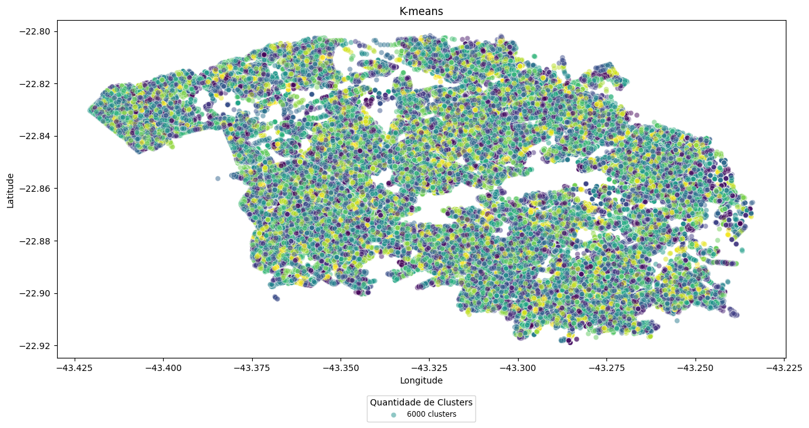
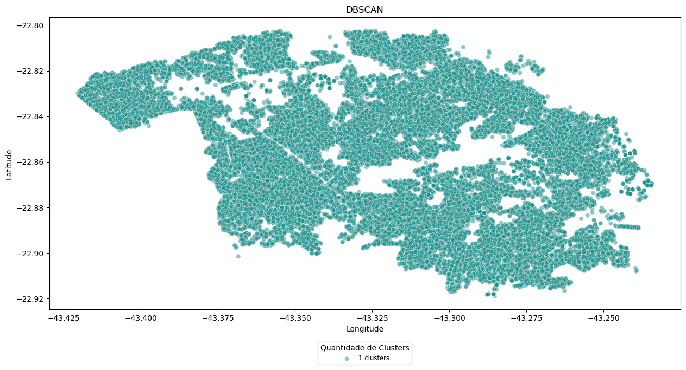

# Clusterização da Amostra Total

&emsp;A clusterização é uma técnica de aprendizado de máquina não supervisionado que envolve agrupar dados semelhantes em conjuntos, chamados de clusters. O objetivo é dividir um conjunto de dados em grupos significativos, onde os itens dentro de cada grupo são mais semelhantes entre si do que com os itens em outros grupos.

&emsp;Ademais, os algoritmos de clusterização procuram identificar padrões nos dados, agrupando-os com base em características como proximidade ou similaridade. Isso pode ser útil em uma variedade de aplicações, como segmentação de clientes, análise de redes sociais, reconhecimento de padrões em imagens, entre outros. 

&emsp; Neste projeto, o primeiro algoritmo desenvolvido para realizar a clusterização da amostra total foi o K-means.  Essa técnica consiste em particionar os dados em k grupos distintos, onde cada grupo, ou cluster, é representado por um centroide, isto é, o ponto médio de todos os pontos atribuídos a esse cluster.

&emsp;O algoritmo opera através de dois passos principais iterativos: inicialmente, os pontos são atribuídos aos clusters mais próximos com base em alguma medida de distância, geralmente a distância euclidiana. Em seguida, os centroides dos clusters são recalculados com base nos pontos atribuídos a cada cluster. Esses passos são repetidos até que os centroides não mudem significativamente entre iterações ou até que um critério de parada seja alcançado. 

&emsp; Sendo assim, o resultado obtido ao plotar 6000 clusters está apresentado na imagem a seguir:

  
<b>Figura 1 </b>- K-means 

  
  
Fonte: elaborado por Aegis

&emsp; O segundo algoritmo desenvolvido foi o Density-Based Spatial Clustering of Applications with Noise (DBSCAN), que consiste em utilizar a densidade dos pontos em um espaço de dados para formar clusters. Ele depende de dois parâmetros principais: a "distância epsilon" (ε), que define a vizinhança de cada ponto, e o "número mínimo de pontos" (MinPts) dentro dessa vizinhança para que um ponto seja considerado como um ponto central de um cluster.

&emsp;Além disso, o DBSCAN é reconhecido por sua capacidade de identificar clusters de forma arbitrária, adaptando-se a formas e tamanhos complexos, além de ser resistente a ruídos e outliers. No entanto, a escolha adequada dos parâmetros ε e MinPts é crucial, uma vez que pode influenciar significativamente os resultados do algoritmo, requerendo ajustes dependendo das características dos dados.

&emsp;Para lidar com a complexidade computacional, dado o tamanho da amostra total de 378300 dados, foi realizada uma clusterização com apenas 10% dos dados selecionados aleatoriamente. O resultado dessa abordagem está disponível na imagem a seguir: 

  
<b>Figura 2 </b>- DBSCAN 

  
  
Fonte: elaborado por Aegis

&emsp; Portanto, a utilização de técnicas de clusterização, como o K-means e o DBSCAN, oferece inúmeras vantagens na análise de dados e na extração de insights valiosos. Ao agrupar dados semelhantes em conjuntos distintos, a clusterização proporciona uma compreensão mais profunda da estrutura dos dados, permitindo a identificação de padrões, segmentação de clientes, fornecendo insights valiosos que podem orientar a tomada de decisões em uma variedade de domínios, entre outras aplicações.