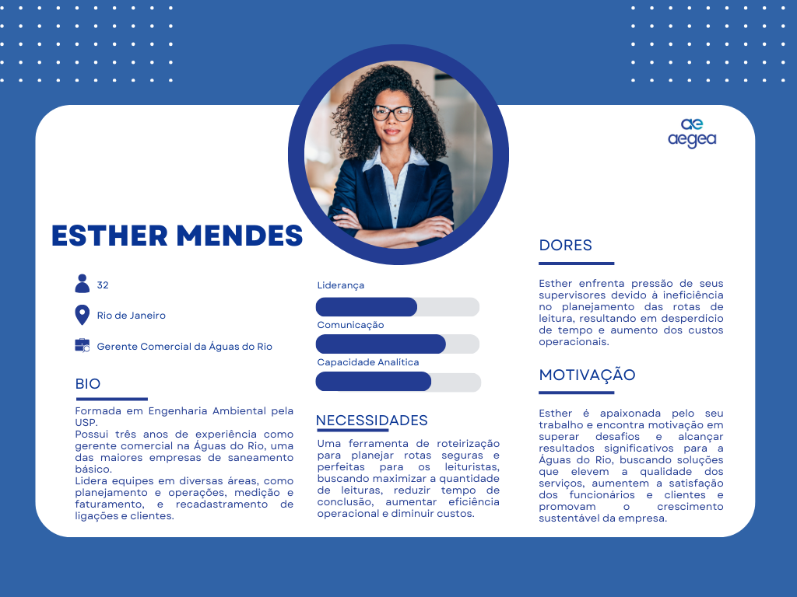

# Entendimento da experiência do usuário

&emsp;Neste documento serão abordados os resultados da pesquisa no que tange à experiência do usuário da Vale, dando destaque para os colaborarem que estão diretamente ligados com o projeto a ser desenvolvido. Aqui, serão exibidos serão apresentandos dois conceitos: personas e User Stories.

## 1. Personas

&emsp;Podemos definir o termo "personas" como uma representação fictícia sobre um determinado nicho. Essa ideia se mostra ainda mais importante durante o desenvolvimento uma nova solução, pois permite entender o perfil de determinado grupo de pessoas, fornecendo um melhor entendimento das suas necessidades para que seja possível construir uma solução que melhor atenda às demandas. Neste projeto, o mapeamento das personas iniciou com a identificação dos stakeholders do projeto. Com isso, foi possível destacar cinco principais grupos:

- **Aegea**: Empresa parceira para o qual este projeto está sendo desenvolvido;

- **Clientes**: Os clientes para os quais a Aegea fornecem água;

- **Leituristas**: Os profissionais da Aegea que vão a campo diariamente para realizar a leitura dos hidrômetros;

- **Time - G4**: Este grupo de desenvolvedores, que trabalhará ativamente na construção da solução;

- **Inteli**: A faculdade deste grupo de desenvolvedores, responsável por mediar e acompanhar o andamento do projeto.

&emsp;Nesse momento, tendo identificado as mais relevantes partes interessadas no negócio, é necessário definir a qual(ais) grupo(s) as personas pertencerão, pois elas guiarão o trabalho deste grupo. Uma ferramenta que ajuda nessa tomada de decisão é a matriz de interesse e poder. Como o nome sugere, ela consiste em uma metodologia baseada em uma matriz dividida em quatro diferentes quadrantes que classificam os _stakeholders_ em grupos de acordo com os níveis de interesse e poder que eles exercem dentro do projeto. Assim, as entidades mencionadas anteriormente foi classificada conforme é possível conferir na imagem a seguir.

  
<b>Figura 1 </b>- Matriz de interesse e poder 

  
  
Fonte: elaborado por Aegis

&emsp;Conforme observado, houve uma divisão em cinco diferentes grupos, os quais a explicação segue abaixo:

- **Aegea**: Alto poder e alto interesse: Considerando que o projeto está sendo desenvolvido para resolver a um problema da própria Aegea, é incostestável o seu interesse. Ao mesmo passo, o nível de poder dela é altíssimo, haja vista que ela intervirá a todo momento para garantir que suas dores estão sendo, quando menos, atenuadas;

- **Inteli**: Baixo poder e alto interesse: Ainda que a faculdade tenha um enorme interesse no desenvolvimento do projeto, o seu poder é baixo, haja vista que a instituição haje mais no sentido de intermediar e oferecer a parceria entre alunos - empresas do que participar efetivamente das decisões e construção das regras de negócio;

- **Time - G4**: Baixo/médio poder e alto interesse: A construção desta solução é de grande interesse para o grupo, haja vista a oportunidade de aprendizado em otimização e a vontade de ver o cliente utilizando algo produzido por estes alunos. Ainda assim, o poder é elencado como baixo/médio, uma vez que, mesmo que o grupo possa optar pela forma como vai modelar o problema matematicamente, representá-lo de maneira visual, etc., as decisões finais acabam recaindo sobre o parceiro.

- **Clientes**: Baixo poder e médio interesse: Embora os clientes finais não tenham controle algum sobre as decisões referentes ao projeto, eles possuem um certo interesse, haja vista que irão beneficiar-se com a implementação da solução. Este interesse, no entanto, não é maior pois eles sequer utilizarão a solução.

- **Leituristas**: Baixo poder e alto interesse: A construção dessa solução irá interferir diretamente no trabalho destes profissionais, e isso justifica o fato do alto interesse no projeto, pois seria muito benéfico que a jornada deles incluísse caminhar menos. Todavia, infelizmente, eles não terão voz para ditar como o projeto deve ser moldado.

&emsp;Um _insight_ interessante fornecido após a aplicação dessa metodologia é a fácil identificação de quem deve ser mapeado como persona. De maneira intuitiva, a entidade a ser escolhida deve ser aquela que está na região do "gerencie de perto". É por isso que, neste caso, a persona deverá representar um colaborador da Aegea. Óbvio, essa ainda é uma definição genérica e não muito representativa, então faz-se necessário afunilar ainda mais quem irá encaixar-se nesse perfil. 

&emsp; Sendo assim, a primeira persona é Esther Mendes, uma profissional altamente qualificada, residente na cidade de Duque de Caxias, no Rio de Janeiro. Com uma sólida formação em Engenharia Ambiental pela USP, Esther acumula três anos de experiência como gerente comercial na Águas do Rio, uma das maiores empresas de saneamento básico do país.

  
<b>Figura 2 </b>- Persona - Esther Mendes

  
  
Fonte: elaborado por Aegis

&emsp;Ao longo de sua carreira, Esther demonstra um compromisso excepcional com a excelência em seu campo, liderando equipes multidisciplinares em diversas áreas, incluindo planejamento e operações, medição e faturamento, e recadastramento de ligações e clientes. Sua abordagem estratégica envolveu o uso de estudos econômico-financeiros, mapeamento cartográfico avançado e contratos de performance para otimizar processos e maximizar resultados.

&emsp;Um aspecto chave do seu trabalho é a sua habilidade em liderar projetos complexos, desde a concepção até a entrega final, destacando-se pela sua capacidade de alcançar resultados excepcionais em um ambiente dinâmico e desafiador.

&emsp;Esther é reconhecida por sua abordagem colaborativa, sua capacidade de superar obstáculos e sua determinação em alcançar resultados significativos para a Águas do Rio e para o setor de saneamento como um todo. Sua paixão pela inovação e pelo desenvolvimento sustentável a impulsiona a continuar buscando soluções criativas e eficazes para os desafios do setor.

#### Desafio Profissional:
&emsp;Como gerente comercial da Águas do Rio, Esther enfrenta o desafio de otimizar as operações de leitura de hidrômetros de consumo mensal de mais de 500 leituristas. O principal obstáculo que ela enfrenta é a falta de um sistema eficiente para planejar as rotas dos leituristas, o que afeta diretamente a produtividade e eficácia operacional.

#### Dor:
&emsp;Esther enfrenta uma pressão por parte de seus supervisores devido à dificuldade em planejar as rotas de leitura de forma eficiente, em razão da falta de uma ferramenta adequada para essa finalidade. O algoritmo atualmente utilizado pela empresa não fornece as informações necessárias, resultando em rotas ineficientes e desperdício de tempo para os leituristas. Esse cenário tem um impacto direto na entrega pontual das contas e na satisfação dos clientes, ao mesmo tempo em que eleva os custos operacionais da empresa.

#### Necessidades:
- Um sistema de otimização de rotas que leve em consideração o tempo de leitura, a velocidade de deslocamento dos leituristas e a distribuição geográfica dos clientes.
-  Um projeto de roteirização que planeje um itinerário perfeito e seguro para os leituristas, visando maximizar a quantidade de leituras, reduzir o tempo de conclusão, aumentar a eficiência operacional e diminuir custos.
- Um algoritmo de otimização que retorne a quantidade de leituristas, o tempo de conclusão, as rotas ideais e o dia em que a leitura deverá ser feita.
- Ferramentas que permitam uma visualização clara e intuitiva das rotas planejadas, facilitando o acompanhamento e ajustes conforme necessário.
- Uma ferramenta que permita realizar modificações nas rotas manualmente caso não seja possível realizar a leitura em um endereço específico e seja necessário retornar a esse local em outro dia.
- Uma ferramenta onde seja possível anotar ocorrências incomuns e imprevistas com os leituristas, como acidentes, condições climáticas adversas, ausência do morador, entre outros motivos que impedem a realização da leitura no dia determinado. 

#### Metas e Objetivos: 
- Melhorar o planejamento das rotas de leituras dos hidrômetros.
- Aumentar a taxa de entrega de contas e adimplência dos clientes, garantindo uma cobrança precisa e oportuna dos serviços prestados.
- Melhorar a produtividade e efetividade da equipe de leituristas, reduzindo o tempo gasto em deslocamentos desnecessários e aumentando o número de leituras realizadas por rota.
- Diminuir a quantidade de rotas e o tempo total de conclusão das leituras.
- Diminuição do custo operacional.
- Ampliar a escalabilidade da tecnologia na área de saneamento.

#### Abordagem Colaborativa:
&emsp;Esther valoriza a colaboração e o trabalho em equipe. Ela está aberta a ideias inovadoras e soluções criativas que possam melhorar as operações da empresa. Ela incentiva o diálogo aberto e a troca de conhecimento entre os membros da equipe, visando alcançar os objetivos comuns de forma eficiente.

#### Motivação:
&emsp;A motivação de Esther vem do desejo de superar desafios e alcançar resultados significativos para a Águas do Rio. Ela está empenhada em encontrar soluções que melhorem a qualidade dos serviços prestados pela empresa, aumentem a satisfação dos clientes e contribuam para o crescimento sustentável do negócio.

#### Características Pessoais: 
- **Proatividade:** Esther é uma profissional proativa, sempre em busca de maneiras de melhorar os processos e operações da empresa.
- **Capacidade Analítica:** Ela possui habilidades analíticas aguçadas, capazes de identificar padrões e tendências que podem ser úteis na otimização das rotas de leitura.
- **Comunicação Efetiva:** Esther é uma comunicadora eficaz, capaz de transmitir suas ideias e direcionar a equipe de forma clara e objetiva.
- **Resiliência:** Ela é resiliente diante dos desafios, capaz de manter-se focada e motivada mesmo diante de obstáculos significativos.

#### Passatempo:
&emsp;Nos momentos de lazer, Esther gosta de praticar atividades ao ar livre, como caminhadas ou trilhas na natureza. Ela também aprecia a leitura de livros sobre liderança e gestão, buscando sempre aprimorar seus conhecimentos e habilidades profissionais.

#### Sonho:
&emsp;O maior sonho de Esther é contribuir para o desenvolvimento sustentável do setor de saneamento básico no Brasil, tornando-o mais eficiente e acessível para todos. Ela deseja fazer parte de projetos inovadores que tenham um impacto positivo na qualidade de vida das pessoas e no meio ambiente.

&emsp; Além disso, para compreender melhor nosso cliente final, desenvolvemos uma segunda persona. Leonardo Silva, de 29 anos, é um leiturista dedicado e reside na Baixada Fluminense, no Rio de Janeiro. Ele concluiu o ensino médio em uma escola pública da região e acumula seis anos de experiência profissional na Águas do Rio, desempenhando o papel crucial de realizar a leitura dos hidrômetros de consumo mensal de água.

  
<b>Figura 3 </b>- Persona Leonardo Silva 

  
  
Fonte: elaborado por Aegis

#### Desafio Profissional: 
&emsp;Leonardo enfrenta o desafio diário de percorrer as rotas de leitura de forma eficiente, garantindo que todos os clientes sejam atendidos dentro do prazo estabelecido pela empresa. Ele precisa lidar com obstáculos como o tráfego urbano, a distância entre os hidrômetros e o tempo necessário para realizar cada leitura.

#### Dor: 
&emsp;A principal dor de Leonardo é a pressão para cumprir as metas de leitura dentro do prazo estipulado, enquanto enfrenta desafios como a falta de uma rota otimizada e a necessidade de cruzar constantemente as ruas para acessar os hidrômetros dos clientes. Isso pode ser desgastante e impactar sua produtividade, eficiência e segurança. Além disso, ele muitas vezes precisa lidar com o fato de que as rotas começam e/ou terminam longe de sua residência, exigindo deslocamentos consideráveis, mesmo que haja rotas disponíveis em sua região.

#### Necessidades: 
- Uma rota de leitura otimizada que minimize o tempo de deslocamento entre os hidrômetros, maximize o número de leituras realizadas por dia e seja segura.
- Rotas que sejam próximas à sua residência e demandem menos deslocamento.
- Rotas que priorizem sua segurança, evitando a necessidade constante de atravessar ruas.
- Suporte da empresa para lidar com situações imprevistas, como clientes ausentes, hidrômetros de difícil acesso, acidentes e condições climáticas adversas.
- Uma visualização mais clara das rotas diárias, por meio de um mapa que indique corretamente as localizações.

#### Metas e Objetivos:
- Cumprir as metas de leitura estabelecidas pela Águas do Rio dentro do prazo determinado, garantindo uma cobrança precisa e oportuna dos serviços prestados.
- Aumentar a eficiência e produtividade em sua rotina de trabalho, realizando um maior número de leituras por dia sem comprometer a qualidade do serviço.
- Auxiliar em outras tarefas da empresa, como campanhas, conversas com os clientes e entregas de notificações e panfletos.
- Participar de treinamentos promovidos pela Águas do Rio. 
- Contribuir para a melhoria contínua das operações da empresa, fornecendo feedback e sugestões para otimizar as rotas de leitura e facilitar o trabalho dos leituristas.

#### Abordagem Colaborativa: 
&emsp;Leonardo valoriza a colaboração com seus colegas de trabalho e a equipe de gestão da Águas do Rio. Ele está aberto a compartilhar suas experiências e desafios enfrentados no dia a dia, buscando soluções conjuntas que beneficiem a todos os envolvidos.

#### Motivação:
&emsp;A motivação de Leonardo deriva do reconhecimento que recebe da empresa, onde é tratado de forma justa e é capaz de sustentar sua família com uma boa qualidade de vida. Esse ambiente de trabalho positivo e o apoio da empresa são elementos fundamentais que impulsionam sua dedicação e comprometimento com suas responsabilidades como leiturista.

#### Características Pessoais:
- **Responsabilidade:** Leonardo é um profissional responsável, comprometido em cumprir suas obrigações e metas profissionais.
- **Resiliência:** Ele é resiliente diante dos desafios do dia a dia, capaz de superar obstáculos e manter-se focado em seus objetivos.
- **Adaptabilidade:** Leonardo é capaz de se adaptar a diferentes situações e condições de trabalho, buscando sempre encontrar soluções eficientes para os problemas que enfrenta.
- **Empatia:** Ele possui empatia pelos clientes e colegas de trabalho, buscando sempre oferecer um serviço de qualidade e colaborar com o bem-estar da equipe.

#### Passatempo:
&emsp;Nos momentos de lazer, Leonardo gosta de praticar esportes ao ar livre, como futebol com os amigos ou caminhada no parque com o seu filho. Ele também aprecia passar tempo com a família e relaxar assistindo filmes ou séries.

#### Sonho:
&emsp;O maior sonho de Leonardo é continuar crescendo profissionalmente na Águas do Rio e alcançar novas oportunidades de desenvolvimento em sua carreira. Ele deseja aprimorar suas habilidades e conhecimentos, tornando-se um líder respeitado dentro da empresa e contribuindo para o sucesso do negócio a longo prazo.

&emsp;Portanto, as personas de Esther Mendes e Leonardo Silva representam de forma vívida os desafios e responsabilidades enfrentados no setor de saneamento. Enquanto Esther, com sua experiência em gestão e inovação, busca incansavelmente soluções eficazes para otimizar rotas e processos, Leonardo, como leiturista dedicado, enfrenta diariamente obstáculos em suas tarefas, ressaltando a necessidade crucial de ferramentas e tecnologias que facilitem suas atividades e melhorem a eficiência operacional da empresa.

## 2. User Stories

### 2.1 Introdução

&emsp;&emsp;Desenvolver uma solução que realmente funcione para os usuários finais exige um entendimento claro do que eles precisam e desejam. Aqui, usamos as User Stories como uma forma direta de captar esses detalhes e guiar o desenvolvimento do nosso projeto. Cada história é construída para ser clara e direta, seguindo a abordagem INVEST para garantir que cada funcionalidade criada seja útil e prática.

&emsp;&emsp;O método INVEST é a base que direciona a criação das nossas User Stories. Cada história é desenhada para ser independente, facilitando a organização do trabalho e evitando atrasos causados por dependências. Elas são negociáveis, permitindo aprimoramentos através do diálogo com os stakeholders, e cada uma adiciona valor claro e concreto para nossos usuários finais. Além disso, as histórias são estimáveis para que possamos planejar com precisão, e são pequenas, para entrega e feedback rápidos. Por fim, cada história é testável, o que nos dá confiança de que os resultados atendem às necessidades e expectativas.

&emsp;&emsp;Assim, as User Stories presentes neste documento vem direto dos grupos mais impactados pelo nosso projeto: Esther Mendes, a gerente que precisa que tudo corra sem problemas, e Leonardo Silva, o leiturista que está no terreno fazendo o trabalho acontecer. Eles são as vozes por trás das histórias que definem o que estamos construindo e por quê. A ideia é manter as coisas práticas, concentrando-se em soluções que façam uma diferença real no dia a dia da Aegea Saneamento.

### 2.2 User Stories do Projeto

### História 1
| Campo | Descrição |
|-------|-----------|
| **Número** | 1 |
| **História** | Como um gerente comercial, eu quero um roteiro de leituras otimizado de maneira a maximizar o número de leituras realizadas pelos leituristas ao mesmo tempo que é possível o tempo gasto em deslocamentos.
| **Critério de Avaliação** | A solução deve ser capaz de gerar um roteiro de leituras mais eficiente para os leituristas. |
| **Teste de Aceitação** | Resultado Esperado: O leiturista consegue realizar mais leituras em menos tempo. Resultado Indesejado: O gerente comercial não percebe melhoria na eficiência das rotas realizadas por cada leiturista. |

### História 2
| Campo | Descrição |
|-------|-----------|
| **Número** | 2 |
| **História** | Como gerente comercial, eu quero uma ferramenta que me permita visualizar em um mapa o roteiro de rotas gerado para entender o tráfego que será feito por cadas leiturista. |
| **Critério de Avaliação** | O sistema deve exibir visualmente um mapa indicando as rotas que serão percorridas e este mapa deve ser atualizado a cada nova execução do algoritmo.  |
| **Teste de Aceitação** | Resultado Esperado: O gerente consegue observar a geração de uma nova visualização (em mapa) a cada execução do algoritmo. Resultado Indesejado: O sistema não atualiza a visualização (em mapa) ou tem atrasos. |

### História 3
| Campo | Descrição |
|-------|-----------|
| **Número** | 3 |
| **História** | Como gerente comercial, eu quero uma solução que indique a rota mais segura entre as leituras para evitar cruzamentos de rua desnecessários e garantir mais segurança para os leituristas da minha empresa. |
| **Critério de Avaliação** | A solução deve sugerir rotas que minimizem os cruzamentos de rua. |
| **Teste de Aceitação** | Resultado Esperado: O leiturista segue a rota sugerida sem cruzar ruas desnecessariamente. Resultado Indesejado: A solução sugere rotas que aumentam o risco de acidentes por haver muitos cruzamentos. |

### História 4
| Campo | Descrição |
|-------|-----------|
| **Número** | 4 |
| **História** | Como gerente comercial, eu quero que o sistema forneça uma opção de comparar rotas para que eu consiga decidir qual delas é melhor aplicável na cotidiano. |
| **Critério de Avaliação** | O sistema deve permitir a comparação entre dois tipos de rota que reflitam a eficiência e pontos de melhoria. |
| **Teste de Aceitação** | Resultado Esperado: O gerente obtém insights através da comparação gerada. Resultado Indesejado: Não existe comparação ou elas não ajudam na tomada de decisão. 

### História 5
| Campo | Descrição |
|-------|-----------|
| **Número** | 5 |
| **História** | Como um leiturista, eu quero que o sistema me permita registrar rapidamente qualquer anomalia detectada durante as leituras para assegurar a qualidade do serviço e a precisão das informações coletadas. |
| **Critério de Avaliação** | O sistema deve permitir um registro fácil e rápido de anomalias. |
| **Teste de Aceitação** | Resultado Esperado: Anomalias são registradas prontamente e sem complicações. Resultado Indesejado: O registro de anomalias é complicado ou demorado. |

## 2.3 Conclusão

&emsp;&emsp;Portanto as User Stories mostradas desempenham um papel essencial no desenvolvimento do nosso projeto, fornecendo um mapa claro dos passos que devemos seguir. Elas são a voz dos leituristas e gestores da Aegea, destacando o que é essencial para melhorar a sua rotina diária e, por consequência, a operação da empresa como um todo. Dessa forma nós definimos com cada história um caminho que não apenas resolve as necessidades imediatas, mas também nos auxilia pras inovações futuras. Elas garantem que o nosso trabalho esteja em alinhado com o objetivo proposto e com o impacto que desejamos causar: um serviço mais eficiente, seguro e satisfatório para todos envolvidos.

&emsp;&emsp;E assim, implementar as funcionalidades detalhadas nestas histórias nos permite não só atingir as metas de curto prazo, mas também estabelecer uma base sólida para o aprimoramento do serviço de leitura de hidrômetros. Elas são projetadas para serem implementadas de forma ágil, possibilitando testes e feedbacks rápidos, e são detalhadas o suficiente para evitar ambiguidades e garantir que cada funcionalidade atenda exatamente às necessidades identificadas.

&emsp;&emsp;Ao concluir esta seção, fica claro que as User Stories são mais do que só simples descrições, elas são compromissos com a experiência do usuário, um reflexo da nossa dedicação em fornecer soluções que realmente façam a diferença. Por meio delas, reafirmamos nosso objetivo de não só atender, mas superar as expectativas, para então proporcionar uma transformação positiva e duradoura nas operações da Aegea Saneamento..

## 3. Jornada de Usuário

&emsp;As Jornadas do Usuário de Esther Mendes e Leonardo Silva são instrumentos cruciais no alinhamento do nosso projeto com as necessidades reais da Aegea. Elas nos permitem visualizar cada etapa que um gerente e um leiturista percorrem, desde o planejamento até a execução e avaliação das rotas de leitura de hidrômetros.

&emsp;A jornada de Esther (Figura 4) nos ajuda a entender as responsabilidades de um gerente comercial na otimização das operações. Ela destaca a necessidade de uma ferramenta que não só crie rotas eficientes mas também permita monitoramento e ajustes rápidos, trazendo uma visão gerencial crítica para o projeto. Através desta jornada, captamos as dores específicas de um gestor e como nossa solução pode aliviar esses pontos, como a pressão por eficiência e custos operacionais reduzidos.

  
<b>Figura 4 </b>- Jornada de Usuário - Esther Mendes 

  
  
Fonte: elaborado por Aegis

&emsp;Leonardo, por sua vez, representa a experiência no campo. Sua jornada (Figura 5)  nos faz entender a importância de uma interface amigável e de um sistema ágil que apoie suas tarefas diárias, garantindo eficiência e segurança. Ele nos mostra como a solução pode impactar positivamente a rotina dos leituristas, tornando seu trabalho não só mais fácil mas também mais seguro e produtivo.

  
<b>Figura 5 </b>-  Jornada de Usuário - Leonardo Silva 

  
  
Fonte: elaborado por Aegis

&emsp;Assim ambas as jornadas enfatizam o valor de uma solução bem desenhada, evidenciando que a eficiência operacional e a satisfação do usuário final andam de mãos dadas. Ao apresentar essas jornadas na documentação, asseguramos que a equipe de desenvolvimento e os stakeholders compreendam o contexto completo de uso da solução proposta, o que é essencial para direcionar o desenvolvimento do projeto e assegurar que o produto final atenda às expectativas e melhore a experiência de todos os usuários envolvidos. As imagens criadas com o template fornecem uma representação visual dessas jornadas, facilitando o entendimento e o engajamento com o processo de desenvolvimento.

## Referências 

WALTER, Stephanie. User Journey Mapping. SitePoint, fevereiro de 2022. ISBN 9781925836493.
