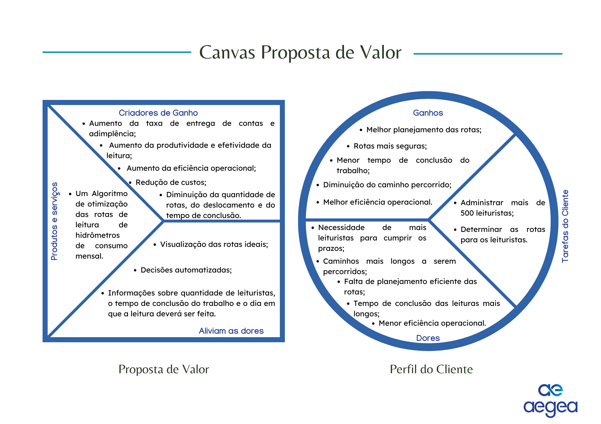
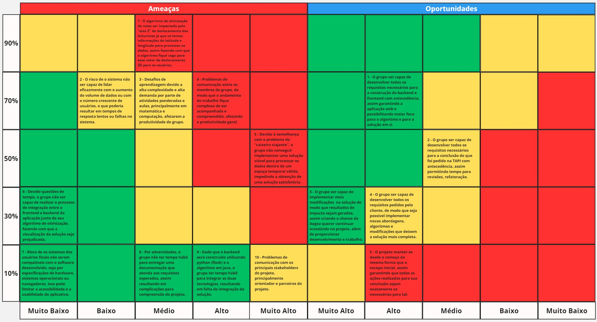

# Artefato de entendimento do negócio

## 1. Canvas Proposta de Valor

&emsp;O Canvas da Proposta de Valor é uma ferramenta estratégica e visual amplamente utilizada no âmbito da gestão e do empreendedorismo. Sua finalidade é desenvolver, testar e construir propostas de valor distintas para os clientes, proporcionando uma compreensão clara de como um produto ou serviço atende às necessidades e desejos do mercado-alvo. Essa abordagem visa assegurar uma adequação precisa entre o produto ou serviço oferecido e as demandas do público, resultando na criação de soluções funcionais e adaptadas.

&emsp;O canvas é estruturado em duas seções principais: o Perfil do Cliente, que aborda suas tarefas, dores e ganhos, e o Produto, que descreve os produtos e serviços oferecidos, bem como os benefícios proporcionados e as soluções para as dores do cliente.

&emsp;Para ilustrar de forma mais eficaz a proposta de valor do projeto, realizou-se uma análise e desenvolvimento do canvas de proposta de valor, conforme apresentado abaixo:

### 1.1 Perfil do Cliente:

&emsp;Essa abordagem fornece uma visão detalhada das tarefas, dores e oportunidades do cliente, ajudando a construir uma proposta de valor sólida e relevante.

#### 1.1.1 Tarefas do Cliente

**Administrar mais de 500 leituristas:**

&emsp;O Gerente Comercial da Águas do Rio é responsável pela supervisão das operações de leitura de hidrômetros, envolvendo mais de 500 leituristas. Isso inclui liderança de equipes diversas e manutenção de uma abordagem operacional eficaz.

**Determinar as rotas para os leituristas:**

&emsp;O Gerente Comercial precisa planejar as rotas de leitura dos hidrômetros, definindo os dias e a quantidade necessária de leituristas para garantir a entrega das contas dentro do prazo.

#### 1.1.2 Dores do Cliente

**Falta de planejamento eficiente das rotas:**

&emsp;Sem uma ferramenta adequada para planejar as rotas de leitura, os leituristas enfrentam trajetos mais longos, demorados e desafiadores, resultando em dificuldades operacionais.

**Necessidade de mais leituristas para cumprir os prazos:**

&emsp;A ausência de uma rota otimizada aumenta a demanda por leituristas para cumprir os prazos estabelecidos.

**Caminhos mais longos a serem percorridos:**

&emsp;A falta de uma rota ideal resulta em trajetos desnecessários, prolongando o percurso de execução das tarefas.

**Tempo de conclusão das leituras mais longo:**

&emsp;Os caminhos ineficientes aumentam significativamente o tempo necessário para concluir as leituras, impactando a produtividade dos leituristas e a capacidade de realizar outras tarefas importantes, tais como campanhas, conversa com os clientes e treinamentos.

**Menor eficiência operacional:**

&emsp;A falta de controle efetivo sobre as rotas dos leituristas compromete a eficiência operacional da empresa.

#### 1.1.3 Ganhos do Cliente

**Melhor planejamento das rotas:**

&emsp;Decisões informadas baseadas em algoritmos possibilitam um planejamento mais eficaz das rotas de leitura.

**Rotas mais seguras:**

&emsp;O planejamento cuidadoso das rotas reduz os riscos para os leituristas, eliminando a necessidade de cruzar constantemente as ruas.

**Menor tempo de conclusão do trabalho:**

&emsp;Rotas otimizadas resultam em uma execução mais rápida das tarefas, evitando deslocamentos desnecessários.

**Diminuição do caminho percorrido:**

&emsp;Rotas bem definidas reduzem a distância total percorrida pelos leituristas, aumentando sua eficiência e produtividade.

**Melhor eficiência operacional:**

&emsp;O controle aprimorado sobre as rotas leva a uma melhoria significativa na eficiência operacional, reduzindo tanto o tempo necessário para concluir o trabalho quanto a necessidade de recursos adicionais.

### 1.2 Proposta de Valor:

&emsp;Esta seção destaca como o produto atende às necessidades do cliente, facilitando suas tarefas e reduzindo suas dores.

#### 1.2.1 Produtos e serviços

**Um Algoritmo de otimização das rotas de leitura de hidrômetros de consumo mensal:**

&emsp;Um algoritmo de otimização que determina a quantidade de leituristas necessários, o tempo estimado de conclusão, as rotas mais eficientes e o melhor dia para realizar as leituras.

&emsp;Um projeto de roteirização que planeje um itinerário perfeito e seguro para os leituristas, visando maximizar a quantidade de leituras, reduzir o tempo de conclusão, aumentar a eficiência operacional e diminuir custos.

#### 1.2.2 Aliviam as dores

**Visualização de rotas ideais:**

&emsp;Um frontend que oferece uma representação visual clara e intuitiva das rotas planejadas, facilitando o acompanhamento e permitindo ajustes conforme necessário.

**Decisões automatizadas:**

 &emsp;Um algoritmo de otimização que, ao receber dados de entrada, fornece informações essenciais sobre as rotas, apresentando automaticamente aos gerentes um planejamento ótimo e aprimorando a eficiência operacional da empresa.

**Informações sobre quantidade de leituristas, o tempo de conclusão do trabalho e o dia em que a leitura deverá ser feita:**

&emsp;Um projeto de roteirização que retorne as rotas ideais, a quantidade de leituristas, o tempo de conclusão do trabalho e o dia em que a leitura deverá ser feita.

#### 1.2.3 Criadores de ganho

**Aumento da taxa de entrega de contas e adimplência:**

&emsp;Com o planejamento otimizado das rotas, as leituras podem ser concluídas mais rapidamente, resultando em uma maior taxa de entrega de contas e adimplência.

**Aumento da produtividade e efetividade da Leitura:**

&emsp;Rotas otimizadas reduzem o tempo e a distância percorrida entre as leituras, aumentando a produtividade e eficiência da equipe.

**Aumento da eficiência operacional:**

&emsp;Com um planejamento de rotas mais eficiente, há uma redução no tempo e recursos necessários para concluir o trabalho, aumentando a eficiência operacional da empresa.

**Redução de custos:**

&emsp;Um planejamento otimizado elimina a necessidade de recursos adicionais, resultando em uma redução significativa de custos para a empresa.

**Diminuição da quantidade de rotas, do deslocamento e do tempo de conclusão:**

&emsp;Com rotas ideais definidas, o deslocamento e o tempo necessário para concluir as tarefas são reduzidos, aumentando a eficiência e produtividade da equipe de leituristas.

&emsp;Portanto, ao desenvolver o canvas de proposta de valor, uma excelente solução poderá ser entregue à Aegea, abordando de forma abrangente e precisa as necessidades e dores enfrentadas pelo cliente final. 

## 2. Matriz de Riscos

&emsp;&emsp;A matriz de risco é uma ferramenta utilizada para avaliar a probabilidade de um evento acontecer, além de medir seus possíveis impactos, ou seja, de que forma ele afetaria o ambiente de trabalho e o desenvolvimento de uma ação e/ou projeto. Somado aos possíveis desafios do projeto, a matriz também contempla oportunidades que podem vir a se desenvolver e que podem ser aproveitadas mediante identificações e ações prévias. Ademais, é de suma importância que a junto à matriz, estratégias de prevenção aos riscos e ações para aproveitar as oportunidades sejam definidas para garantir que adversidades não afetem negativamente no desenvolvimento de uma solução.

&emsp;&emsp;Essa ferramenta de negócios é de suma importância como uma forma de proporcionar a reflexão e compreensão sobre quais os riscos e oportunidades que podem se desenrolar durante todo o processo de desenvolvimento da solução. A matriz engloba tanto questões diretamente ligadas ao MVP, quanto fatores de impacto no processo de construção do produto, como problemas interno de organização, questões de comunicação, imprevistos externos ao projeto e outras situações que podem gerar impacto negativo (no caso das ameaças) ou positivos (no caso das oportunidades). Para cada ameaça identificada, um plano de ação foi traçado para garantir que essa dificuldade possa ser superada com facilidade, bem como planos de ação para fazer bom uso das oportunidades.

 

   <b>Figura X -</b> Matriz de Riscos

   

      </a>
   

   Fonte: Elaboração _Nome do grupo_ (2024)

 

&emsp;&emsp;Como apresentado na figura, uma série de riscos e oportunidades foram traçados de acordo com seu nível de impacto e probabilidade de acontecerem. Cada posicionamento foi feito conforme o quão complexo seria de reverter a situação das ameaças, e o quão benéfica cada oportunidade poderia ser para o projeto e para os membros do grupo. De mesmo modo, foi realizada uma avaliação da probabilidade de cada uma dessas situações ocorrerem com base em fatores de experiência, compreensão do problema, conversas com o parceiro e com os principais _stakeholders_ do projeto. Em seguida, foram desenvolvidas estratégias para lidar com cada ameaça e oportunidade. Para auxiliar na compreensão, as ameaças foram numeradas de 1 até 10, e as oportunidades de 1 até 5. Essas numerações podem ser identificadas antes do enunciado de cada ameaça/oportunidade.

**Estratégias para cada ameaça:**

**01 -** Os dados passados pelo cliente apenas apresentam a latitude e longitude dos pontos de cada ponto de medição, ou seja, não há informações sobre a altitude (eixo Z de deslocamento) o que pode causar uma disparidade significativa entre os resultados do algoritmo e o que realmente acontece dado o deslocamento real dos leituristas. Mediante isso, investigar a implementar tecnologias alternativas de geolocalização que incluam os dados de altitude pode ser uma boa estratégia para mitigar a disparidade dos dados e garantir que uma prescrição mais assertiva possa ser feita.

**02 -** Pelo problema em questão envolver uma grande quantidade de dados que serão processados por um algoritmo complexo, é possível que a aplicação desenvolvida sofra com problemas de desempenho, sendo assim, desde o princípio do desenvolvimento, é vital que uma arquitetura escalável com padrões consistentes de engenharia de software sejam feitos para evitar sobrecarga na plataforma, além da realização de testes de desempenho com uma grande quantidade de dados para avaliar seus limites e possíveis oportunidades de otimização.

**03 -** O módulo 06 focado em otimização é um dos módulos mais desafiadores dentre todos os cursos do Inteli, destacando-se tanto por sua complexidade matemática quanto por diversos conceitos novos altamente demandantes da computação, sendo assim uma das principais formas de mitigar as possíveis dificuldades desse módulo é a realização consistente dos autoestudos, participação ativa nas aulas, conversas regulares com professores em caso de dúvidas e a organização interna do grupo e da sala para garantir que todos estão na "mesma página" em questão de conteúdos teóricos, assim garantindo um ambiente de aprendizado contínuo e colaborativo, tornando os desafios do módulo mais simples de serem superados.

**04 -** Problemas de comunicação são comuns em qualquer projeto, principalmente em cenários com pouco tempo de desenvolvimento e diversas demandas. Sendo assim, é de suma importância que as ferramentas de comunicação que já utilizamos sejam devidamente aplicadas por meio da participação ativa de todos os membros nas reuniões diárias, comunicação constante pelo _slack_, conversas de alinhamento durante os períodos de desenvolvimento e de fechamento de cada dia. Ademais, a implantação de um sistema de gerenciamento como o _GitHub Projects_ seguindo boas práticas é um adicional valioso para garantir que todos os membros estejam informados sobre o progresso e responsabilidade de cada um.

**05 -** Por estarmos lidando com um problema de alta complexidade de categoria _NP-hard_, uma estratégia para lidar com ele de forma mais eficiente é explorar e implementar algoritmos heurísticos, ou seja, de aproximação que ofereçam soluções suficientemente boas em um tempo viável e aplicável para a empresa.

**06 -** O desenvolvimento web é uma parte importante da construção da solução uma vez que proporciona maior facilidade para utilizar os algoritmos desenvolvidos, entretanto também é uma etapa muito trabalhosa e que demanda de esforço de toda a equipe. Sendo assim, uma forma de garantir que seja possível finalizar o desenvolvimento dessa etapa e integrar tudo é designando tempo e recursos para o desenvolvimento dessa etapa desde as fases iniciais do projeto, além do uso de ferramentas e arquiteturas que facilitem o processo de integração da aplicação.

**07 -** Incompatibilidades entre software e hardware podem acontecer a depender das tecnologias implementadas, precisamente por isso, cabe ao grupo selecionar as ferramentas mais adequadas para uso do parceiro visando minimizar erros técnicos, além de realizar testes de compatibilidade em diferentes sistemas operacionais, navegadores e especificações de hardware durante o desenvolvimento, assim garantindo que esse risco possa ser evitado para a grande maioria dos cenários.

**08 -** A documentação é de vital importância para o desenvolvimento de um projeto uma vez que ela garante que a solução possa ser compreendida e utilizada mesmo pelas pessoas que não estavam diretamente envolvidas no processo de desenvolvimento, sendo assim, para garantir que a documentação esteja completa até o final do projeto, deve-se manter a constância em seu preenchimento, visando mantê-la atualizada a cada nova fase do projeto, além de garantir que devidas correções sejam feitas quando necessário e que todos os principais aspectos da solução estejam presentes em forma de texto.

**09 -** A princípio, o _backend_ está sendo construído em _python_ usando _Flask_ para garantir maior velocidade em seu desenvolvimento, enquanto o algoritmo de otimização será construído em Java por questões de eficiência. Sendo assim, é de suma importância que arquiteturas de solução que favoreçam esse processo de integração sejam aplicadas, além do uso de interfaces bem definidas como _APIs REST_ e conteinerização que são boas opções para garantir essa integração.

**10 -** Para garantir que a comunicação com os _stakeholders_ do projeto seja feita de maneira eficiente, é necessário que os membros do grupo se mantenham ativos através dos meios de comunicação principais (Slack e comunicação na sala de aula) além de seguir os rituais definidos pela metodologia ágil, assim garantindo a devida participação e boa comunicação com os principais meios para a resolução do projeto.

**Estratégias para cada oportunidade:**

**01 -** A oportunidade de adiantar o desenvolvimento da aplicação web é um tanto provável de acontecer já que a organização do grupo na primeira sprint demonstrou-se boa, assim fazendo com que esse adiantamento possa efetivamente acontecer. Caso o _frontend_ e _backend_ sejam finalizados com tal adiantamento, o tempo extra poderá ser utilizado para construir e aperfeiçoar mais os algoritmos de otimização, assim fazendo com que o principal foco do módulo e da resolução do problema do parceiro possa receber maior atenção de todos os membros do grupo.

**02 -** Caso o grupo finalize os principais requisitos solicitados pela TAPI com antecedência, é válido que tanto a solução como a documentação passem por devidas revisões para garantir que tudo tenha realmente sido concluído. Ademais, um plano para essa etapa é conversar com os _stakeholders_ do projeto sobre possíveis melhorias que poderiam ser feitas tendo esse adiantamento em vista.

**03 -** Caso o projeto desenvolvido pelo grupo tenha resultados além do esperado, indicando que ele foi concluído com sucesso e atendendo as demandas esperadas, o contato com o cliente pode ser mantido, assim garantindo que a implementação da solução seja bem sucedida, além de que possíveis desenvolvimentos posteriores ao projeto possam ser feitos.

**04 -** Em caso de desenvolvimento de todos os requisitos pedidos pelo cliente ao ponto de possibilitar o aprimoramento dos algoritmos implementados, uma boa estratégia é manter um contato constante com os professores para garantir que as modificações feitas não estão afetando negativamente na execução dos algoritmos e garantem efetivamente uma melhoria no desempenho dos modelos matemáticos aplicados no projeto.

**05 -** Esse caso seria de extrema raridade já que a tendência do projeto é sempre ser iterado e passar por mudanças que causem sua evolução e adequação para o que realmente é necessitado pelo parceiro. Entretanto, caso aconteça, uma medida é manter as ações restritas ao que foi pedido na TAPI e conversado inicialmente, além de buscar por melhorias que o próprio grupo vê como potencial para aplicar no projeto.

## 3. Matriz de Oceano Azul

&emsp;&emsp;A matriz de oceano azul é uma ferramenta poderosa que, se utilizada de forma correta, pode permitir que a empresa crie uma vantagem competitiva que a diferencie do seu concorrente, de forma a isolá-la no "oceano" do mercado em que está inserida. Em suma, o conceito de Oceano Azul, fundado por Renée Mauborgne e W. Chan Kim, diz respeito a uma abordagem que se baseia na exploração de mercados pouco buscados. Assim, a empresa é capaz de superar a competição, e "nadar" livremente em um ambiente que não é explorado por outras companhias. A matriz de Oceano Azul, por sua vez, busca elencar o que é necessário para atingir tal objetivo. 

&emsp;&emsp;Ao atingir um Oceano Azul, uma empresa é capaz de alcançar altos lucros, já que estará atuando em um mercado com uma concorrência irrelevante, e por consequência terá o monopólio dessa área. Logo, é capaz de determinar o preço do seu produto com maior flexibilidade, e não enfrenta riscos consideráveis de ser substituído. 

&emsp;&emsp;Para permitir uma melhor visualização, é possível comparar os atributos do projeto e dos concorrentes, incluindo o algoritmo atual do parceiro. Assim, é possível perceber o que foi alterado visando alcançar o Oceano Azul.

   Figura 1: Matriz de Oceano Azul

   Fonte: Elaborado pelos autores (2024)

### 3.1. Reduzir
&emsp;&emsp; A etapa de reduzir leva em conta os atributos que não podem ser eliminados do produto, mas podem ser reduzidos, para se diferenciar da concorrência. Por exemplo, o preço pode ser diminuído para garantir uma maior atratividade no quesito ecnômico. 

&emsp;&emsp;Em relação ao projeto, o que podemos ter como redução tange principalmente a diminuição do tempo de trabalho do leiturista, e como consequência a redução do seu custo. Isso se deve já que, com menos tempo, serão necessários menos leituristas, e portanto uma redução dos custos. 

### 3.2. Eliminar 
&emsp;&emsp;O processo de eliminar diz respeito aos serviços que podem ser retirados do produto sem que afetem a percepção de valor do cliente. Por exemplo, em uma loja de roupas, os descontos oferecidos podem ser eliminados. Apesar dessa decisão poder diminuir a satisfação do cliente, ela não irá alterar a sua percepção da proposta de valor do produto. 

&emsp;&emsp; Em relação ao projeto, pode ser eliminado o processo manual de decisão das rotas, e a intervenção do cliente nessa escolha. Com o algoritmo, tudo isso será feito de forma automática pelo computador.

### 3.3. Criar 
&emsp;&emsp;O passo de criar tange os segmentos de negócio que ainda não são abordados pela empresa, mas que podem ser explorados para criar *features* que aumentam o valor do produto. Por exemplo, o time de futebol Flamengo criou um time de *e-sports*, de forma a abordar um novo mercado, o de *games*, e atrair novos públicos.

&emsp;&emsp;No que tange ao projeto, pode-se considerar a criação de uma interface mais interativa para o cliente, que permita a visualização da rota definida pelo algoritmo.   

### 3.4. Elevar
&emsp;&emsp;O processo de elevar, por sua vez, consiste na análise de um serviço já oferecido pela empresa, mas que pode ser desenvolvido em alguma esfera, de forma a promover o seu valor. Por exemplo, o Cirque du Soleil, ao adicionar elementos de alta qualidade em seus espetáculos, como música ao vivo, cenários elaborados. 

&emsp;&emsp;Considerando o contexto do projeto, é possível elevar o processo de visita das residências, a fim de fazer os registros necessários, e também garantindo uma maior facilidade de entrega das contas. Além disso, o algoritmo pode ser melhorado, garantindo uma precisão maior, no que tange a eficiência das rotas escolhidas de percorrer a menor distância possível, e criando uma interface que permita uma interação visual para o cliente.

## 4. Análise Financeira do Projeto

&emsp;Pensando no contexto de desenvolvimento projetos, embora sempre seja esperado algum tipo de ganho, é necessário, de antemão, pensar nos gastos necessários para a sua elaboração. Afinal, ninguém investirá tempo e dinheiro em algo se não houver um retorno maior do que o aplicado. Pensando nisso, este grupo elaborou uma estimativa dos custos e retornos que a Aegea teria com a construção e implementação desta solução. Dessa forma, é possível alinhar expectativas junto ao cliente e facilitar a tomada de decisões estratégicas dentre as diversas áreas da empresa.

### 4.1 Custos

&emsp;A princípio, o cliente mencionou durante o workshop que estaria disposto a investir R$ 150.000,00 para a entrega deste _MVP_. Assim sendo, esta análise irá iniciar pontuando os gastos necessários, que existem somente dois tipos: os relacionados às ferramentas e tecnologias utilizadas no projeto e aqueles relacionados à remuneração dos desenvolvedores. 

&emsp;No tocante ao primeiro destes, é importante ressaltar que o cliente não demonstrou interesse em uma interface _front-end_, além de destacar que o principal entregável é o algoritmo em si, que pode ser executado no computador de algum dos colaboradores, por exemplo. Sendo assim, as despesas dessa primeira etapa estão unicamente relacionadas ao processamento de dados.

&emsp;Um dos dados disponibilizadas pelo cliente foi a latitude e longitude dos pontos dos hidrômetros nos quais a leitura precisa ser feita. Contudo, considerando a grande variação no declive do terreno da cidade do Rio de Janeiro, um dado importante é a elevação (em relação ao nível do mar) da coordenada, haja vista que subir uma ladeira, é uma rota mais "pesada" do que andar em linha reta. Para se obter esses dados, foi levado em consideração a existência de 1,6 milhão de pontos utilizando a _Google API Elevation_, cuja utilização é necessária somente uma vez para cada ponto. Assim, os gastos ficam assim distribuídos:

**Tabela 01**: Precificação de uso do Google API Elevation
| Descrição | Preço unitário | Preço total |
|---|---|---|
| Primeiras 100.000 requisições | US$ 0,005 | US$ 500,00 |
| 1.500.000 requisições restantes | US$ 0,004 | US$ 6.000,00 |
|  | **TOTAL** | US$ 6.500,00* |

**Fonte**: Elaborada pelos autores com base nas informações fornecidas pela Google

* Pela cotação atual do dólar, esse valor equivale a R$ 33.510,10.

 

&emsp;Em seguida, foi realizada uma consulta no portal _Glassdoor_ para encontrar o salário pago pela Aegea a um analista júnior, que corresponde ao nível dos desenvolvedores deste grupo. Assim, foi possível identificar que a remuneração por semana corresponde a R$ 656.25 por semana. Porém, considerando os encargos sociais e benefícios que os empregadores devem arcar sob o salário, conforme apontado por Brasil (1991) e Brasil (1943), esse valor aumenta cerca 60%, indo para R\$ 1.050,00 por semana.

&emsp;Portanto, considerando que o desenvolvimento deste trabalho dura 10 semanas e, considerando ainda que existem 6 integrantes no grupo, o total investido ($T$) em remuneração será dado conforme a expressão 1.

$$T = 10 \cdot 6 \cdot 10050 = 63.000$$

  
  $(1)$

&emsp;Também é importante observar que esta análise deve contemplar um horizonte de um ano, faz-se necessário incluir o pagamento de um analista pleno, o qual ficará responsável de, após a entrega por parte deste time, fazer as adaptações e modificações na solução de acordo com o que o cliente necessitar. Ainda de acordo com as informações do _Glassdoor_, esse salário custa cerca de R$ 4.500,00, os quais acrescidos dos 60%, atinge R\$7.200,00. Assim, considerando que esse suporte será fornecido por 9 meses, o custo (S) referente a esse analista é obtido na expressão 2.

$$S = 9 \cdot 7.200 = 64.800$$

  
  $(2)$

&emsp;Por fim, a tabela abaixo resume o montante total necessário para investir neste projeto. É importante lembrar que o valor total será acrescido de 5%, quantia esta destinada a lidar com imprevistos e eventos não planejados no decorrer dessa iniciativa.

**Tabela 02**: Descrição do investimento necessário

| Descrição | Valor |
|---|---|
| Custos da Google Elevation API | R$ 33.510,10 |
| Custos da equipe de desenvolvimento | R$ 63.000,00 |
| Custos do analista de acompanhamento | R$ 64.800,00 |
| **SUBTOTAL** | R$ 161.310,10 |
| Reserva de contingência (5%) | R$ 8.065,50 |
| **TOTAL** | R$ 169.375,60 |

**Fonte**: Elaborada pelos autores

### 4.2 Receitas

&emsp;Este é um projeto interno que será utilizado apenas por colaboradores da Aegea. Nesse sentido, como não há nada a ser comercializado, não existe receitas vindas diretamente da venda da solução. Apesar disso, existe a previsão de que esta iniciativa ajude a realizar uma redução nos gastos da empresa.

&emsp;Atualmente, a leitura dos hidrômetros na cidade do Rio de Janeiro é realizada por 400 leituristas. O algoritmo de otimização aqui desenvolvido espera melhorar a produtividade de leitura em 5%. Isso implica em uma redução de 20 funcionários para realizar esse mesmo processo de leitura.

&emsp;Além disso, em workshop com o parceiro, foi revelado que cada um desses colaboradores custa, mensalmente, aproximadamente R$ 6.000,00 para a Aegea. Nesse sentido, uma redução de 20 funcionários durante o horizonte de 12 meses implica em uma redução de gastos conforme ilustrado na expressão 3.

$$S = 20 \cdot 12 \cdot 6.000 = 1.440.000$$

  
  $(3)$

&emsp;Portanto, este grupo planeja que, com a solução, haverá uma redução de R$ 1.440.000,00 nos gastos com pagamento dos salário de colaboradores da Aegea. Isso é um bom sinal de que, embora os custos ultrapassem o orçamento inicial dito pelo parceiro (que era de R\$ 150.000,00), os ganhos obtidos superam os gastos orçados.

### REFERÊNCIAS

BRASIL. Lei Nº 5.425, de 1 de maio de 1943. **Aprova a Consolidação das Leis do Trabalho**. Brasília, DF: Diário Oficial da União, 1943.

BRASIL. Lei Nº 8.212, de 24 de julho de 1991. **Dispõe sobre a organização da Seguridade Social, institui Plano de Custeio, e dá outras providências**. Brasília, DF: Diário Oficial da União, 1991.

CURVELO, Rakky. 2024. Entenda a estratégia do Oceano Azul e como ela pode impactar sua empresa. Disponível em: https://br.hubspot.com/blog/marketing/oceano-azul#:~:text=A%20estrat%C3%A9gia%20do%20Oceano%20Azul%20%C3%A9%20um%20m%C3%A9todo%20de%20orienta%C3%A7%C3%A3o,para%20fugir%20de%20mercados%20saturados. Acesso em: 24 abr. 2024. 

GALICA, Laura. 2021. A estratégia do oceano azul: como inovar o seu modelo de negócio e tornar a concorrência irrelevante. Disponível em: https://www.jreng.net/post/a-estrategia-do-oceano-azul-como-inovar-o-seu-modelo-de-negocio-e-tornar-a-concorrencia-irrelevante. Acesso em: 24 abr. 2024.

GLASSDOOR. **Salários de Analista Júnior da empresa Águas do Rio** . [_s.l._], 2024. Disponível em: <https://www.glassdoor.com.br/Sal%C3%A1rio/%C3%81guas-do-Rio-Analista-J%C3%BAnior-Sal%C3%A1rios-E5858429_D_KO13,28.htm>. Acesso em 21 de abr. de 2024.

GLASSDOOR. **Salários de Analista Pleno da empresa Águas do Rio** . [_s.l._], 2024. Disponível em: <https://www.glassdoor.com.br/Sal%C3%A1rio/%C3%81guas-do-Rio-Analista-Pleno-Sal%C3%A1rios-E5858429_D_KO13,27.htm>. Acesso em 21 de abr. de 2024.

GOOGLE. **Uso e faturamento da API Elevation**. [_s.l_], 2024. Disponível em: <https://developers.google.com/maps/documentation/elevation/usage-and-billing?hl=pt-br>. Acesso em 21 de abr. de 2024.

KIM, W. Chan; MAUBORGNE, Renée. A estratégia do oceano azul: como criar novos mercados e tornar a concorrência irrelevante. 2004. 

ROVINA, Jackson. 2019. A estratégia do oceano azul: entenda por que o melhor jeito de vencer os concorrentes é parar de competir. Disponível em: https://www.euax.com.br/2019/12/a-estrategia-do-oceano-azul/. Acesso em: 24 abr. 2024. 
