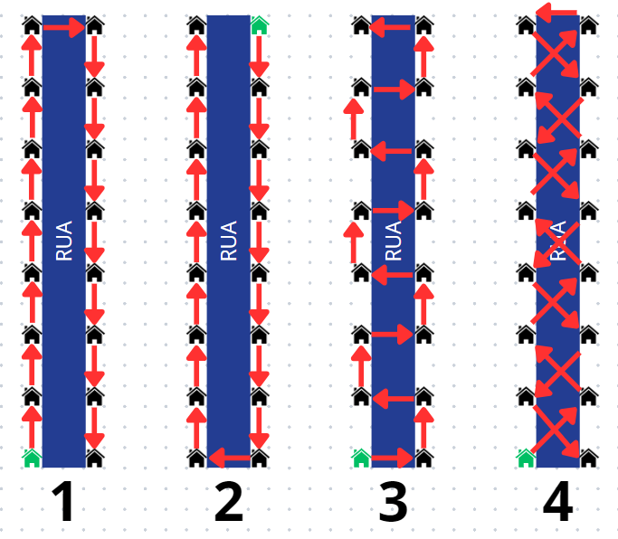

# Entendimento do contexto do problema: modelagem e representação

&emsp;&emsp;Esta seção detalha a modelagem do contexto operacional para o projeto de otimização das rotas de leitura de hidrômetros do parceiro de projeto. A necessidade de otimização decorre de um processo existente que demanda rotas diárias, executadas a pé por leituristas e com deslocamento realizado por diversos meios de transporte, cobrindo mais de 1,6 milhões de ligações apenas na Águas do Rio, refletindo a complexidade e a escala das operações. Uma única rota pode contar com inúmeros pontos, e a sua otimização torna-se essencial para garantir a maior eficiência do uso de tempo dos leituristas.

## Contexto do Problema

&emsp;&emsp;A Aegea Saneamento, líder no setor privado de saneamento básico no Brasil, enfrenta o grande desafio  de modernizar o processo de leitura de hidrômetros para otimizar a faturação do consumo de água e elevar a eficiência operacional. Diante da necessidade de concluir todas as leituras em até 22 dias úteis, a empresa se vê comprometida a desenvolver rotas estrategicamente planejadas que minimizem as travessias de vias, reduzindo riscos e tempo perdido, o que msotra a importânciade implementar soluções inovadoras. O sistema manual atual, embora extensivo, resulta em rotas ineficientes e diversas inconsistências, falhando em maximizar a utilização de recursos e em atender a diversidade de perfis de consumidores espalhados por uma vasta área geográfica. Esta situação complexa e desafiadora exige um planejamento eficaz e uma resposta ágil para superar essas barreiras operacionais, enfatizando a necessidade de uma abordagem mais estruturada e tecnologicamente avançada.

&emsp;&emsp;Com a missão de promover saúde, qualidade de vida e dignidade para mais de 31 milhões de pessoas, o parceiro busca aprimorar as métricas de leitura de hidrômetros, um esforço que impacta diretamente o faturamento e a satisfação do cliente—pilares para a sustentabilidade e expansão da infraestrutura de saneamento básico. Mensalmente, cerca de 400 a 600 leituristas gerenciam mais de 4.000 rotas, um processo que, atualmente, apresenta uma otimização insatisfatória e uma produtividade que não maximiza o tempo e recursos disponíveis.

&emsp;&emsp;Assim, a otimização das rotas busca reformular as operações atuais, diminuindo o tempo necessário para completar os percursos e melhorando a precisão das leituras, ao passo que reduz a necessidade de cruzamentos de vias, garantindo uma maior segurança dos leituristas. Este esforço visa transformar a metodologia operacional para elevar a eficiência e reduzir o tempo médio de conclusão das rotas, atualmente em 7 horas com uma efetividade de 80% na leitura, abordando tanto os desafios logísticos quanto a experiência do cliente final.

&emsp;&emsp;Portanto, este projeto almeja não só impulsionar a eficácia e o rendimento dos leituristas, mas também ajustar as operações para reforçar o comprometimento da empresa em elevar a qualidade de vida e avançar no desenvolvimento das áreas atendidas. A integração desses objetivos ao modelo operacional proposto fortalecerá a posição da Aegea no mercado, melhorando significativamente tanto a entrega de contas quanto a adimplência dos clientes, culminando em um posicionamento ainda mais robusto no mercado.

## Dados Disponíveis

&emsp;&emsp;Para enfrentar os desafios operacionais e de planejamento, a Aegea Saneamento e Participações S.A. forneceu dois conjuntos de dados detalhados, fundamentais para a otimização das rotas de leitura de hidrômetros. Estes conjuntos, denominados "AMOSTRA_MENOR" e "AMOSTRA_TOTAL", compreendem registros variados que incluem desde coordenadas geográficas até códigos de rota, passando por informações completas de endereço. A "AMOSTRA_MENOR" serve como um subset para testes iniciais e desenvolvimento do algoritmo, enquanto a "AMOSTRA_TOTAL" abrange um volume mais abrangente de dados para simulações e análises mais complexas.

&emsp;&emsp;Adicionalmente, a Aegea disponibilizou as coordenadas de duas bases operacionais essenciais, que desempenham um papel fundamental na logística diária das rotas de leitura. Estas bases, situadas em locais estratégicos, facilitam o acesso dos leituristas aos diversos pontos de partida das rotas, otimizando o tempo de deslocamento inicial e permitindo um planejamento mais eficiente. Essa informação geográfica detalhada não só ajuda na logística de distribuição dos leituristas, mas também serve como um ponto crítico para o lançamento e término das operações diárias, assegurando que as rotas sejam cumpridas dentro dos parâmetros operacionais previstos. A estrutura desses dados inclui:
- **Coordenadas Geográficas**: Latitude e longitude para localização precisa dos pontos de leitura.
- **Código da Rota e Sequência de Leitura**: Identificadores que auxiliam na estruturação das rotas e na ordem dos serviços a serem realizados.
- **Informações de Endereço**: Detalhes como logradouros e números de residências, essenciais para a localização exata pelos leituristas.

&emsp;&emsp;Todos esses dados são protegidos por acordos de privacidade, garantindo a segurança das informações e conformidade com as normas de proteção de dados. A análise desses registros é crucial para moldar as estratégias de otimização, permitindo a Aegea não apenas melhorar a eficiência das rotas, mas também simular diferentes cenários operacionais, o que é vital para alcançar os melhores resultados em campo.

## Objetivo do Problema

&emsp;&emsp;Diante do exposto, é fácil observar que o objetivo deste projeto culmina na elaboração de um algoritmo de otimização das rotas de leitura dos hidrômetros da Aegea. Contudo, essa ainda é uma informação vaga e que precisa ser melhor detalhada. É por isso que, inicialmente, este grupo se propõe a resolver a desenvolver esse otimizador considerando que todos os clientes devem ser lidos em até 22 dias de leitura, cada rota deve ter duração de até 6 horas por dia, que o leiturista caminha com a velocidade de 5 km/h e que a visita (tempo de leitura) dura 2 minutos. Ademais, o objetivo principal do problema é o da **minimização** das distâncias percorridas em cada rota. Como consequência, a quantidade de leituristas poderia ser diminuída e isso geraria valor para o clinte e facilitaria o trabalho já realizado.

&emsp;&emsp;Além disso, deve-se, ainda que em uma etapa de pós-otimização, minimizar a quantidade de vezes que os leituristas cruzam ruas, devido ao risco de acidentes. Um exemplo pode ser observado na imagem abaixo.

&emsp;&emsp;Nesta imagem, casas adjacentes possuem uma distância equidistante, tanto horizontalmente quanto verticalmente. Percebamos que em todos os exemplos estamos fazendo a leitura de todos os locais, iniciando-se na casa verde. Porém, é importante observar que somente os exemplos 1 e 2 satisfazem o nosso objetivo, haja vista que estes cruzam a rua somente uma vez (o mínimo possível para realizar a leitura). 

&emsp;&emsp;Em contrapartida, no exemplo 3, embora a distância percorrida seja a mesma que nos exemplos anteriores, houve um número muito alto de cruzamentos. Por fim, o pior exemplo é o número 4, que além de ter maximizado a quantidade de cruzamento de ruas, ainda percorreu uma distância maior que nos exemplos precedentes. Logo, estes são dois cenários que não podem ser resultados deste algoritmo.

## Recursos e Limitações

&emsp;&emsp;O problema em questão apresenta diversas restrições que limitam a abordagem para a sua resolução. Três dessas limitações destacam-se significativamente: os dias de leitura restritos, as horas de trabalho diárias limitadas e o fato de cada cliente só poder ser visitado apenas uma vez.

&emsp;&emsp;A restrição quanto aos dias de leitura, estipulando um máximo de 22 dias disponíveis, impõe uma barreira temporal que pode impactar diretamente na eficácia do planejamento das visitas. Com um número limitado de dias para realizar as leituras, é necessário otimizar cuidadosamente a distribuição das ligações a serem visitadas em cada dia, garantindo que todas as demandas sejam atendidas dentro desse intervalo de tempo pré-determinado.

$$t \leq 22 \text{ dias} $$

&emsp;&emsp;Além disso, a limitação das horas de trabalho diárias dos leituristas a um máximo de 6 horas por dia também representa um desafio significativo. Essa restrição impõe uma restrição adicional à capacidade de realização de trabalho em um único dia. A alocação eficiente das rotas a serem visitadas deve levar em consideração não apenas o número total de ligações, mas também a capacidade de trabalho diária dos leituristas, garantindo que o tempo disponível seja utilizado da forma mais produtiva possível.

$$ \frac{t}{d} \leq 6 \text{ horas} $$

&emsp;&emsp;Ademais, respeitando as restrições de tempo, um cliente só pode ser visitado uma vez a cada 22 dias.

$$ n = \text{número total de clientes} $$

$$ \sum_{i=1}^{n} \, i \neq j \, x_{ij} = 1, \, \forall_j = 1, \ldots, n $$
$$ \sum_{j=1}^{n} \, j \neq i \, x_{ij} = 1, \, \forall_i = 1, \ldots, n $$

&emsp;&emsp;Sendo assim, para que o algoritmo de otimização funcione, as seguintes limitações devem ser seguidas:

- Dias de leitura: até 22 dias;

- Horas de trabalho diárias: até 6 horas/dia;

- Todas as ligações devem ser visitadas apenas uma única vez a cada ciclo de leitura (22 dias);

- Em todas as rotas, têm que ser possível ir de um ponto ao outro através de um caminho factível de ser percorrido;

- Não pode ter subciclos;
  
- Não pode percorrer de um ponto para ele mesmo.

&emsp;&emsp;Essas limitações exigem uma abordagem cuidadosa e estratégica na resolução do problema, buscando otimizar as rotas das leituras e maximizar a eficiência operacional dentro das restrições estabelecidas. Ao enfrentar esses desafios, é essencial encontrar um equilíbrio entre a distribuição das ligações, o tempo disponível e a capacidade de trabalho dos leituristas, visando atender às demandas de forma eficaz e minimizando o impacto das restrições sobre o planejamento das rotas.

## Função Objetivo e Restrições

&emsp;&emsp;Com o objetivo de compreender melhor o problema abordado, especialmente se tratando de um desafio de otimização, é fundamental desenvolver um modelo matemático. A modelagem deve incluir as variáveis de decisão, a função objetivo (o que se deseja maximizar ou minimizar) e as restrições do problema, que delimitam as soluções viáveis. O projeto compartilha semelhanças com um desafio clássico da computação, conhecido como o Problema do Caixeiro Viajante. Este  envolve encontrar o caminho mais eficiente para um viajante visitar um conjunto de cidades uma única vez e retornar ao ponto de partida, minimizando a distância total percorrida.

&emsp;&emsp;Inicialmente, a modelagem matemática foi estruturada com base no problema do caixeiro viajante, como uma primeira abordagem para entender o problema proposto pela empresa parceira. No entanto, nota-se a necessidade de adaptar esse modelo às especificidades do desafio em questão. Portanto, futuros ajustes e refinamentos na modelagem serão realizados para torná-la mais adequada e precisa em relação ao problema real.

### Variável de decisão
$$
x_{ij} = 
\begin{cases} 
1 & \text{se a rota incluir uma aresta entre os hidrômetros } i \text{ e } j, \\
0 & \text{caso contrário}.
\end{cases}
$$

&emsp;&emsp;A variável $x_{ij}$ é binária. Sua função é indicar se existe uma ligação direta entre os hidrômetros $i$ e $j$ na rota otimizada para solucionar o problema. Tal variável de decisão é de suma importância para determinar a estrutura do caminho formado.

### Função objetivo
$$
\min \sum_{i=1}^{n} \sum_{\substack{j=1 \\ j \neq i}}^{n} d_{ij} x_{ij}
$$

&emsp;&emsp;A função objetivo busca minimizar a distância total da rota. $d_{ij}$ representa a distância associada ao percurso entre os hidrômetros $i$ e $j$. Os somatórios percorrem todas as possíveis conexões entre pares distintos de hidrômetros, ponderando cada conexão pela distância correspondente e pela variável de decisão.

### Restrições

#### Restrições de grau de saída e de entrada

$$
\sum_{\substack{i=1 \\ i \neq j}}^{n} x_{ij} = 1 \quad \text{para todo } j = 1, 2, \ldots, n
$$

$$
\sum_{\substack{j=1 \\ j \neq i}}^{n} x_{ij} = 1 \quad \text{para todo } i = 1, 2, \ldots, n
$$

&emsp;&emsp;As restrições acima garantem que cada hidrômetro $i$ seja ponto partida e de chegada de apenas uma conexão, cada hidrômetro está conectado a apenas a um outro, indicando a rota seguida pelo leiturista.

#### Restrição para não permitir a formação de subrotas (ciclos)

$$
\begin{equation}
\sum_{i,j \in S} x_{ij} \leq |S| - 1, \quad \text{para } S \subseteq \{2, \ldots, n\}, \quad 2 \leq |S| \leq n - 1
\end{equation}
$$

&emsp;&emsp;A restrição impõe que, dado um subconjunto de vértices $S$, apenas $|S| − 1$ arcos possam ser escolhidos para solução, apresentado uma sub-rota caso o contrário aconteça.

#### Restrição que define variáveis $x_{ij}$ como binárias

$$
x_{ij} \in \{0, 1\}, \quad \forall i, j = 1, 2, \ldots, n, \quad i \neq j
$$

&emsp;&emsp;Essa restrição define claramente que as variáveis $x_{ij}$ são exclusivamente binárias, assim garantino que as conexões entre os hidrômetros serão apenas "percorridas" ou "não percorridas".

#### Restrição para variáveis contínuas e positivas

$$
S \in \mathbb{R}^{+}, \quad \forall i = 1, 2, \ldots, n
$$

&emsp;&emsp;Esta restrição assegura que o conjunto de rotas $S$, utilizado para prevenir subrotas, seja positivo, reforçando sua interpretação como uma ordem sequencial ou posição na rota.

#### Restrição do limite de horas de trabalho por dia para cada leiturista (específica do projeto)

$$
2n + \frac{d}{v} \le 360
$$

&emsp;&emsp;Considerando _n_ como o número de leituras feitas por um leiturista em uma rota, _2n_ representa os dois minutos que cada leitura leva. Tal tempo é somado a $\frac{d}{v}$ que representa a distância percorrida em um dia (d) sobre a velocidade média de deslocamento dos leituristas (v) resultando em seu tempo de deslocamento naquele dia. O resultado dessa soma deve ser menor ou igual a 360 minutos (6 horas de trabalho). Restrição essa colocada pelos parceiro de projeto.

#### Restrição do limite de dias de leitura (específica do projeto)

$$
t \leq 22 
$$

&emsp;&emsp;Considerando $t$ como uma variável que representam os dias de leitura, é de suma importância que ela seja menor ou igual a 22 dias, sendo essa uma necessidade expressa pelo parceiro do projeto.

## Análise de sensibilidade

&emsp;&emsp;Dentro do contexto de otimização, a análise de sensibilidade é um método utilizado para determinar como a variação nos dados de entrada de um modelo impacta os resultados obtidos. Ela ajuda a identificar quais parâmetros são mais influentes na solução final e para entender a robustez das soluções propostas frente às incertezas dos dados de entrada.

&emsp;&emsp;É válido destacar que a análise de sensibilidade é teoricamente possível em programação inteira. Contudo, as técnicas são menos desenvolvidas, mais complexas e frequentemente exigem abordagens computacionais mais intensivas para obter insights significativos

&emsp;&emsp;Nesse sentido, considerando que o problema do caixeiro viajante é de programação inteira, esta análise levará em consideração como sse ele fosse um problema de programação linear. Isso pode gerar algumas situações que não fazem sentido, como, por exemplo, percorrer 0,4 de uma cidade a outra. Essa análise reduzida contará com 5 pontos reais da amostragem do parceiro, conforme é destacado na tabela abaixo.

| **Ponto** | **Descrição** |
|:---:|:---:|
| A | R. ATILIO PARIM, 251 |
| B | R. ANTONIO LOPES, 81 |
| C | R. SAO CIRO, 108 |
| D | R. MIN ARTUR COSTA, 432 |
| E | R. CRISTIANO MACHADO, 591 |

&emsp;&emsp;Para além disso, foi calculada a distância entre cada um dos pontos. Esses dados são mensurados (em metros) na tabela abaixo. É importante destacar que a distância de uma cidade até ela mesma foi destacada como 999999 para que o _Solver_ do Excel (ferramenta utilizada para obter essa solução) não utilize essa rota ao gerar o menor caminho possível.

|   | **A** | **B** | **C** | **D** | **E** |
|:---:|:---:|:---:|:---:|:---:|:---:|
| **A** | 9999999 | 1150 | 290 | 500 | 1000 |
| **B** | 1150 | 9999999 | 1160 | 660 | 370 |
| **C** | 290 | 1160 | 999999 | 580 | 920 |
| **D** | 500 | 660 | 580 | 999999 | 580 |
| **E** | 1000 | 370 | 920 | 580 | 999999 |

&emsp;&emsp;Com a aplicação do solver, o resultado obtido foi destacado abaixo. O esperado seria que só houvessem valores 0 (indicando que aquele caminho não foi utilizado) ou 1 (indicando que o caminho foi usado). Contudo, como mencionado anteriormente, estamos considerando como se o problema fosse de programação linear.

|  | **A** | **B** | **C** | **D** | **E** |
|:---:|:---:|:---:|:---:|:---:|:---:|
| **A** | 0 | 0 | 0,4 | 0,6 | 0 |
| **B** | 0 | 0 | 0 | 0,2 | 0,8 |
| **C** | 1 | 0 | 0 | 0 | 0 |
| **D** | 0 | 0,2 | 0,6 | 0 | 0,2 |
| **E** | 0 | 0,8 | 0 | 0,2 | 0 |

&emsp;&emsp;Por fim, destacamos abaixo a um relatório de sensibilidade das células variávies, que foi gerado pelo Excel.

| **Nome** | **Valor Final** | **Custo Reduzido** | **Objetivo Coeficiente** | **Permitido Aumentar** | **Permitido Reduzir** |
|:---:|:---:|:---:|:---:|:---:|:---:|
| **A A** | 0 | 9999789 | 9999999 | 1E+30 | 9999789 |
| **A B** | 0 | 780 | 1150 | 1E+30 | 780 |
| **A C** | 0,4 | 0 | 290 | 550 | 0 |
| **A D** | 0,6 | 0 | 500 | 0 | 550 |
| **A E** | 0 | 710 | 1000 | 1E+30 | 710 |
| **B A** | 0 | 780 | 1150 | 1E+30 | 780 |
| **B B** | 0 | 9999469 | 9999999 | 1E+30 | 9999469 |
| **B C** | 0 | 710 | 1160 | 1E+30 | 710 |
| **B D** | 0,2 | 0 | 660 | 710 | 80 |
| **B E** | 0,8 | 0 | 370 | 80 | 1E+30 |
| **C A** | 1 | 0 | 290 | 0 | 1E+30 |
| **C B** | 0 | 710 | 1160 | 1E+30 | 710 |
| **C C** | 0 | 999629 | 999999 | 1E+30 | 999629 |
| **C D** | 0 | 0 | 580 | 1E+30 | 0 |
| **C E** | 0 | 550 | 920 | 1E+30 | 550 |
| **D A** | 0 | 0 | 500 | 710 | 0 |
| **D B** | 0,2 | 0 | 660 | 710 | 80 |
| **D C** | 0,6 | 0 | 580 | 0 | 710 |
| **D D** | 0 | 999209 | 999999 | 1E+30 | 999209 |
| **D E** | 0,2 | 0 | 580 | 550 | 80 |
| **E A** | 0 | 710 | 1000 | 1E+30 | 710 |
| **E B** | 0,8 | 0 | 370 | 80 | 1E+30 |
| **E C** | 0 | 550 | 920 | 1E+30 | 550 |
| **E D** | 0,2 | 0 | 580 | 550 | 80 |
| **E E** | 0 | 999629 | 999999 | 1E+30 | 999629 |

&emsp;&emsp;Passemos, então, para a análise de sensibilidade propriamente dita. A primeira coisa a se perceber é que as variáveis AA, BB, CC, DD e EE possuem um valor final de 0 e um custo reduzido extratosférico. Isso é um indicativo de que essas rotas nunca serão incluídas na solução ótima. Isso é, obviamente, esperado, haja vista que os valores de 999.999 foram colocados propositalmente para que estes caminhos não entrassem na solução.

&emsp;&emsp;Para a rota AC, é importante observar que o custo reduzido é de 0. Além disso, está ativa na solução com espaço para aumentar até 550. Ela não tem margem para redução, indicando que qualquer diminuição pode tornar a solução **inviável** ou **subótima**.

&emsp;&emsp;Já quando olhamos para AD e BD, é possível observar que elas, de maneira similar, possuem margens limitadas de ajuste. Para AD, não existe espaço para aumento, enquanto a redução pode ser de até 550. Para BD, tanto o aumento quanto a redução são possíveis até 710 e 80, respectivamente. Isto implica que poderíamos explorar uma redução em AD.

&emsp;&emsp;Finalmente, outros dois _insights_ que podemos tirar diz respeito às células BE e CA. A primeira delas tem uma margem de redução praticamente ilimitada ao mesmo tempo que uma margem de aumento de 80. Isso mostra que há uma grande flexibilidade para diminuir o valor desta variável sem comprometer a solução ótima, mas se aumentarmos de maneira significativa podemos nos deparar com uma solução problemática. E, quanto a CA, o valor está completamento fixado em 1 e não há espaço para aumento (obviamente).

## Referências

DE AZEVEDO, Caroline Sales; MALDONADO, Michelli. Análise das restrições de eliminação de sub-rotas do tipo fluxo de commodities para o problema do caixeiro viajante assimétrico. 2021.

FERREIRA, Ivanilda Agustinho. João Pessoa. CAIXEIRO VIAJANTE: APLICAÇÃO DA MODELAGEM MATEMÁTICA NA OTIMIZAÇÃO DE ROTAS EM UMA CONCESSIONÁRIA DE ENERGIA ELÉTRICA. v. 20 n. 1, 2020.
