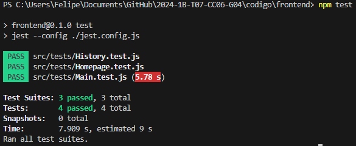

# Testes de Aplicação

## Introdução
Este documento descreve os testes realizados na aplicação para verificar seu funcionamento correto nos cenários essenciais. Os testes foram feitos para garantir que a interface do usuário funciona conforme o esperado, do envio dos dados de entrada até a obtenção dos resultados. 

## Páginas Testadas
1. **Homepage**:
   - **Teste:** Verificação da renderização da página e upload de arquivos CSV.
   - **Importância:** Garante que a página inicial carrega corretamente e que o usuário pode fazer o upload de arquivos, fundamental para o funcionamento da aplicação.

2. **Main**:
   - **Teste:** Verificação da execução do cálculo com dados conhecidos.
   - **Importância:** Assegura que os cálculos de roteirização são feitos corretamente e que os resultados são exibidos adequadamente no mapa. Este teste valida a interação do usuário com os campos de entrada e a exibição dos resultados.

3. **History**:
   - **Teste:** Verificação da renderização da página de histórico e exibição dos dados.
   - **Importância:** Garante que o histórico das execuções anteriores é exibido corretamente, permitindo ao usuário revisar os resultados passados.

## Execução dos Testes
Os testes foram realizados utilizando a biblioteca `@testing-library/react` e `jest`. A configuração do ambiente de testes foi feita no arquivo `jest.config.js`, que especifica como os arquivos devem ser transformados e mapeados. Além disso, foram adicionados arquivos de mock (`fileMock.js`) para simular arquivos estáticos e a configuração do Babel (`babel.config.js`) para transformar o código JavaScript.

### Passos para Execução dos Testes
1. **Configuração do Ambiente de Testes**:
   - Arquivo `jest.config.js` configurado para utilizar o ambiente `jest-environment-jsdom` e `@testing-library/jest-dom/extend-expect` para asserções adicionais.

2. **Comandos para Execução dos Testes**:
   Para executar os testes, siga os seguintes passos:

   ```bash
   # Navegue até o diretório do código
   cd codigo

   # Navegue até o diretório do frontend
   cd frontend

   # Instale as dependências
   npm install

   # Execute os testes
   npm test
   ```

3. **Testes Específicos**:
   - **Homepage**: Verificação da renderização e upload de CSV.
   - **Main**: Simulação da seleção de algoritmo e entrada de dados para calcular a roteirização.
   - **History**: Renderização da tabela de histórico com dados conhecidos.

## Resultados
Todos os testes passaram com sucesso, conforme a execução abaixo:



A imagem acima mostra a saída do comando `npm test`, que executa todos os testes definidos no projeto. A saída exibe informações sobre quais testes foram executados e se passaram ou falharam. No caso da imagem, vemos que todos os testes passaram, indicando que as funcionalidades principais da aplicação estão funcionando corretamente. Cada linha verde representa um teste que foi executado com sucesso, e o tempo de execução de cada teste é mostrado à direita.

## Conclusão
A inclusão desses testes é fundamental para a manutenção da qualidade da aplicação. Eles fazem com que a interface do usuário e a lógica de negócios funcionam conforme o esperado, prevenindo possíveis erros e garantindo que a aplicação responda corretamente às entradas fornecidas.

Este documento serve como referência para a execução dos testes e deve ser atualizado conforme novos testes sejam adicionados ou modificados.
